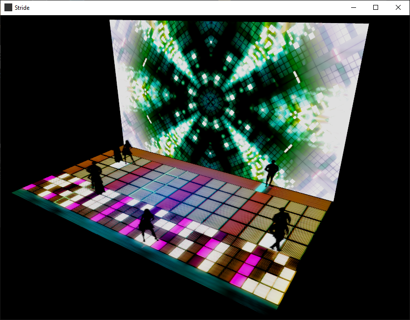

# Ars-Deep-Space
VVVV Tools For Use in AEC Deep Space 

## Deep Space Simulator
Takes renders as Stride textures and gives a model with simulated human poster cutouts following the TUIO input from the Pharus tracking system
## XML-Common
A basic XML read/write to automatically update Stride scenewindow sizing and placement for testing and final production
## DeepSpaceTemplate
Includes XML read/write to automatically update Stride scenewindow sizing and placement for testing and final production and a few extra variables for testing as well as the TUIO synthetic data generator from the Deep Space Simulator
## DeepSpace-ScreenConfig
A simplified setup for testing and arranging windows for a DS project based on common situations. Currently limited to expectation of dual 4k output.
### Sample Image

